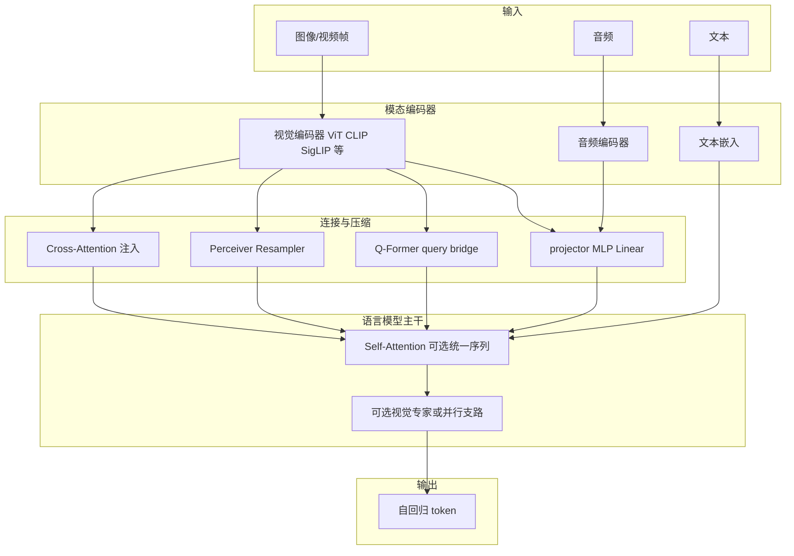

# 多模态基础模型实现调研：最终简报

**日期**：2026-03-24  
**主题**：机制级结论汇总、范式与局限、先修问题与阅读路线  
**使用说明**：本文是 `base-model-survey/2026.3.24/` 系列备忘录的收束篇；标注文献已验证与推断。

---

## 1. 最重要的五条结论

| # | 结论 | 类型 | 置信度 |
|---|------|------|--------|
| 1 | 主流实现可归纳为 **连续嵌入对齐（projector/Q-Former）、交叉注意力注入、统一离散 token** 三条主路径；工程上常 **组合**（如 C+F）。 | 文献已验证 + 归纳 | **高** |
| 2 | **连接器/压缩模块** 是通量与细粒度能力的常见瓶颈，与 **token 预算、KV 压力** 形成三角约束。 | 文献已验证（广泛讨论）+ 推断 | **高** / **中** |
| 3 | 训练普遍 **分阶段**（对齐 → 联合/指令），以平衡稳定性与遗忘；**最优阶段与配比仍高度经验化**。 | 文献已验证 / 推断 | **高** / **中** |
| 4 | **细粒度 grounding、长视频因果、跨模态组合推理** 仍受「语义—像素鸿沟」与「时间压缩损失」制约，非单纯扩大参数可解。 | 文献已验证（评测共识）+ 推断 | **高** / **中** |
| 5 | **多模态 scaling law** 较文本更不清晰，扩展决策需同时看 **数据覆盖、模态平衡与系统约束**。 | 推断为主 | **中** |

---

## 2. 多模态 Base 模型实现总图

下列示意图概括「输入 → 编码 → 连接 → LLM → 输出」及常见变体；**推断**：真实系统会在各框内叠加子模块。

**说明**：**统一 token 路线** 将多模态先 **离散化** 再进入共享词表，上图可视为「在 TE 前增加 VQ 视觉 token」的特例。**推断**。**置信度：中**。

---

## 3. 最主流的 1–2 种实现范式及核心局限

### 范式 A：外部编码器 + projector/轻量桥接 + 冻结/半冻结 LLM（LLaVA 系、Idefics2、InternVL、Pixtral 等）

| 方面 | 内容 |
|------|------|
| **文献已验证** | 开源生态广泛采用；模块名 **projector** 常见 |
| **核心局限（推断）** | 接口容量与 token 预算限制细粒度与长上下文；编码器与 LLM 能力域可能错配 |

**置信度：高**（范式存在）；**中**（局限在具体任务上程度不同）。

### 范式 B：冻结双塔 + Q-Former 或交叉注意力注入（BLIP-2、Flamingo 等）

| 方面 | 内容 |
|------|------|
| **文献已验证** | Q-Former、Gated XATTN 等为论文明确模块 |
| **核心局限（推断）** | 固定 query 或交叉注意力开销；与「极简部署」有时矛盾 |

**置信度：高**。

**补充（文献已验证）**：**统一自回归 token**（Chameleon、Emu3、Kosmos、Fuyu）为并行范式，局限在训练稳定性与数据/词表工程。**置信度：高**（路线存在）；**中**（相对优劣）。

---

## 4. 后续优化研究最关键的五个先修问题

| # | 先修问题 | 为何要先搞清楚 |
|---|----------|----------------|
| 1 | 选定路线下 **视觉 token 数与有效分辨率的换算关系** | 直接决定瓶颈在编码器还是 LLM |
| 2 | **连接器类别**（线性/MLP/Q-Former/cross-attn）对 **通量** 的可分离影响 | 避免把 LLM 问题误判为视觉问题 |
| 3 | **位置编码**（含 M-RoPE、多图分隔）对 **布局/多帧** 的适用范围 | 多图文档与视频必碰 |
| 4 | **训练阶段**与 **数据配比** 的公开消融在目标模型上的可迁移性 | 少实验前提下靠文献对齐预期 |
| 5 | **推理约束**（延迟、KV、最大长度）是否写死 | 决定优化入口偏架构还是系统 |

**类型**：问题清单为 **推断性研究规划**。**置信度：中**。

---

## 5. 接下来两周阅读清单与顺序（论文为主，不做实验）

**说明**：顺序由「接口 → 规模化 → 统一范式 → 音视频扩展」递进；标题为方向，具体篇目以你手边 PDF 为准。

| 周 | 顺序 | 阅读簇 | 目的 |
|----|------|--------|------|
| 第 1 周 | 1 | Flamingo、BLIP-2 | 交叉注意力与 Q-Former 两条「接口」经典定义 |
| 第 1 周 | 2 | LLaVA（1.0/1.5 技术报告或论文） | 开源默认配方：projector + 指令数据 |
| 第 1 周 | 3 | CogVLM 或 InternVL 其一 | 内部专门化 vs 强视觉塔的差异叙事 |
| 第 2 周 | 4 | Qwen2-VL / Qwen2.5-VL 技术说明 | 动态分辨率、位置与长序列组织 |
| 第 2 周 | 5 | LLaVA-NeXT / Interleave 公开材料 | 多图与高分辨率数据管线 |
| 第 2 周 | 6 | Chameleon 或 Emu3（择一深入） | 统一 token 与训练挑战 |
| 第 2 周 | 7 | Video-LLaVA、Qwen2-Audio 其一 | 时间维与音频接入的典型路径 |

**文献已验证**：上述方向均对应真实发表或官方技术报告题名。**推断**：两周内「精读 4–6 篇 + 泛读其余」较现实。**置信度：中**。

---

## 6. 小结

- **文献已验证**：当前主流可概括为「桥接注入类」与「统一自回归类」并存，且与动态分辨率、长序列组织深度融合。  
- **推断**：优化研究应优先在 **connector—token—位置/时间编码** 三角内提出问题。  
- **置信度：高**（总判断）；**中**（阅读节奏个体化）。
